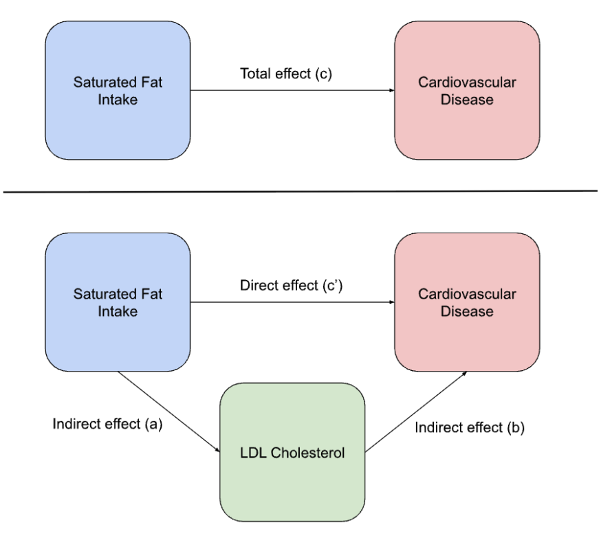

<div align="center">
  
</div>

---

# Accounting for Mediation Effects in Risk Prediction Calculators

**Prepared by:** 		

Boaz Y. Saffer, PhD  
Chief Scientific Officer, Harrison Healthcare

**Date:** August 9th, 2024

## Table of Contents

[Introduction](#introduction)

[Shrier et al.'s (2018) Generalization of the HCRI equation](#shrier-et-al.’s-\(2018\)-generalization-of-the-hcri-equation)

[Mediation Effects](#mediation-effects)

[Limitation of the Generalized HCRI Equation](#limitations-of-the-generalized-hcri-equation)

[Incorporating Mediation Effects into the Generalized HCRI Equation](#incorporating-mediation-effects-into-the-generalized-hcri-equation)

[Citations](#citations)

[Appendix A. Enhanced Equation Spreadsheet](#appendix-a.-enhanced-equation-spreadsheet)

## Introduction

Accurate risk assessment tools are essential to personalized medicine, enabling healthcare providers to deliver tailored advice and interventions based on individual risk profiles. Traditional risk calculators, such as the Harvard Cancer Risk Index (HCRI) developed by Colditz et al. (2000) and later expanded by Kim, Rockhill, & Colditz (2004), have provided valuable frameworks for calculating a person’s risk for developing various types of cancer. However, these tools have limitations, particularly in managing complex, multi-level risk factors.

Shrier, Colditz, & Graham (2018) addressed some of these limitations by generalizing the HCRI equation to include risk factors with three or more levels. This generalization improved the accuracy of risk estimates and expanded the applicability of risk calculators to different health conditions and patient profiles. Despite these advancements, the generalized HCRI equation by Shrier et al. (2018) does not account for interactions between individual risk factors, such as sleep and stress levels, nor does it address common mediation effects between lifestyle factors (e.g., saturated fat intake) and biomarkers (e.g., LDL cholesterol).

Incorporating both lifestyle factors and biomarkers into the generalized HCRI equation presents a challenge of double-counting. Specifically, the biomarker's impact is counted twice: once as the effect of the lifestyle factor (e.g., high saturated fat intake increasing LDL levels, raising cardiovascular risk) and again as the independent effect of the biomarker (e.g., high LDL levels directly increasing cardiovascular risk). This double-counting results in an inflated and inaccurate overall risk calculation. To ensure accurate risk assessments, the generalized HCRI equation must be modified to separate direct and indirect effects, thus preventing double-counting and providing a more precise estimation of risk.

This white paper details the development of an enhanced equation capable of integrating direct and indirect mediation effects, demonstrates its application through examples, and discusses the implications for clinical practice. By incorporating both biomarkers and lifestyle factors, this enhanced equation provides a more accurate and holistic view of patient health and facilitates more effective prevention and management of chronic diseases.

# Shrier et al.’s (2018) Generalization of the HCRI equation

The generalized equation developed by Shrier et al. (2018) extends the Harvard Cancer Risk Index (HCRI) to accommodate risk factors with more than two levels. Specifically, a person’s relative risk (RR) for developing a specific health condition, compared to the average population risk, is calculated as:

```math
\text{RR}_{\text{RFL/pop}} = \frac{\text{RR}_{\text{RFL/r}}}{(P_1 \times \text{RR}_{1/r}) + (P_2 \times \text{RR}_{2/r}) + (P_3 \times \text{RR}_{3/r}) + \ldots + (P_k \times \text{RR}_{k/r})}
```

 Where:

* $\text{RR}_{\text{RFL/pop}}$ is the relative risk comparing the patient's risk to the average population risk.  
* $\text{RR}_{RFL/r}$ is the relative risk for the patient's level of the risk factor.  
* $P_k$ is the prevalence of the $k$-th level of the risk factor.  
* $\text{RR}_{k/r}$ is the risk ratio for the $k$-th level of the risk factor.

This equation can also be rewritten more succinctly as:

```math
\text{RR}_{\text{RFL/pop}} = \frac{\text{RR}_{\text{RFL/r}}}{\sum_{k=1}^{n} P_k \cdot \text{RR}_{k/r}}
```

Where the sum operator $\sum_{k=1}^{n}$ indicates the sum of the products of $P_k$ and $\text{RR}_{k/r}$ for each level $k$ of the risk factor, from $k = 1$ to $k = n$, where $n$ is the total number of levels for that risk factor.

## Worked example

Using Shrier et al.’s (2018) equation involves determining the prevalence and RR for each level of the risk factor and then computing a weighted average to derive the population-referenced RR. For example, consider calculating a female’s risk for developing type-2 diabetes based on their history of cigarette smoking and average hours of sleep per night. Below are values taken from peer-reviewed articles:

Cigarette Smoking:

* Never smoker: $\text{RR} = 1, P = 0.44$  
* Former smoker: $\text{RR} = 1.23, P = 0.39$  
* Light-moderate smoker (0-20 cigarettes per day): $\text{RR} = 1.29, P = 0.12$  
* Heavy smoker (20+ cigarettes per day): $\text{RR} = 1.61, P = 0.05$

Sleep:

* Sleeping 0-7 hours per night: $\text{RR} = 1.280, P = 0.14$  
* Sleeping 7-9 hours per night: $\text{RR} = 1, P = 0.80$  
* Sleeping 9+ hours per night: $\text{RR} = 1.48, P = 0.06$

First, we calculate the combined prevalence of each risk factor.

For Cigarette Smoking:  
```math
\sum_{k=1}^{4} P_k \cdot RR_{k/r} = (0.44 \cdot 1) + (0.39 \cdot 1.23) + (0.12 \cdot 1.29) + (0.05 \cdot 1.61)
```

```math
= 0.44 + 0.48 + 0.15 + 0.08
```

```math
= 1.15
```  
   
For Sleep:  
```math
\sum_{k=1}^{3} P_k \cdot RR_{k/r} = (0.14 \cdot 1.280) + (0.80 \cdot 1) + (0.06 \cdot 1.48)
```

```math
= 0.18 + 0.80 + 0.09
```

```math
= 1.07
```  
   
Next, we calculate the individual's risk of developing type 2 diabetes. Suppose the person is a light-moderate smoker (0-20 cigarettes per day) and sleeps 9+ hours per night. The RR values are 1.29 for light-moderate smoking and 1.48 for sleeping 9+ hours per night.  
   
Using the generalized formula:

```math
RR_{\text{combined}} = \frac{RR_{\text{smoking}}}{\sum_{k=1}^{4} P_k \cdot RR_{k/r} \text{ (for smoking)}} \times \frac{RR_{\text{sleep}}}{\sum_{k=1}^{3} P_k \cdot RR_{k/r} \text{ (for sleep)}}
```  
   
```math
RR_{\text{combined}} = \frac{1.29}{1.15} \times \frac{1.48}{1.07}
```  
   
```math
RR_{\text{combined}} = 1.12 \times 1.38 \approx 1.55
```

This result indicates that an individual who is a light-moderate smoker (0-20 cigarettes per day) and sleeps 9+ hours per night has approximately a 1.55 times higher risk of developing type 2 diabetes compared to the average risk in the general population.

# **Mediation Effects**

Mediation occurs when the relationship between an independent variable (e.g., lifestyle factor) and a dependent variable (e.g., a health outcome) is explained through a third variable (i.e., the mediator). In the context of health risk assessment, a mediator can modify the impact of a lifestyle factor on the development of a health condition. For instance, the relationship between physical activity and mental health can be mediated by social engagement, or the relationship between stress levels and job performance can be mediated by sleep quality.

Biological mediation plays a crucial role in the development of chronic diseases. For example, high saturated fat intake can lead to elevated LDL cholesterol levels, which subsequently increase the risk of cardiovascular diseases (Siri-Tarino, Sun, Hu, & Krauss, 2010). Here, LDL cholesterol acts as a mediator between dietary habits and disease risk. Recognizing and accounting for such mediations is essential for accurate risk assessment, as it helps understand the pathways through which lifestyle factors influence health outcomes.

## **Illustration of Mediation Effects**

In mediation analysis, the total effect of an independent variable on a dependent variable includes both direct and indirect effects. 

<div align="center">
  
</div>

* The top part of the image shows the total effect (c) of saturated fat intake on cardiovascular disease risk.

* The bottom part of the image breaks this down into direct (c') and indirect effects (a and b).

The direct effect is the portion of the total effect not mediated by the biomarker, representing the direct relationship between the lifestyle factor and the health outcome. In this example, high saturated fat intake might directly increase the risk of cardiovascular disease through mechanisms other than LDL cholesterol, such as inflammation.  
The indirect effect is the portion mediated by the biomarker, showing how the lifestyle factor affects the health outcome through the biomarker. Using the same example illustrated in the image, high saturated fat intake raises LDL cholesterol levels, which in turn increases cardiovascular disease risk. The increase in risk due to higher LDL cholesterol is the indirect effect.

### 

# **Limitations of the Generalized HCRI Equation**

As noted, Shrier et al.’s (2018) generalization of the HCRI equation, while effective for comparing overall health risks, faces limitations when calculating mediation effects between lifestyle factors and biomarkers. This is due to the equation not taking into account mediation effects between variables, which leads to double-counting. Double counting occurs when the impact of a biomarker (in this case, the mediator) is counted twice: first as the effect of a lifestyle factor (e.g., high saturated fat intake increasing LDL levels, which raises cardiovascular risk), and again as the independent effect of the biomarker itself (e.g., high LDL levels directly increasing cardiovascular risk). This double-counting results in an inflated and inaccurate overall risk calculation.

To illustrate the issue of double counting in calculating the mediation effects between lifestyle factors and biomarkers, consider the relationship between saturated fat intake, LDL cholesterol levels, and cardiovascular risk.

Here are some hypothetical Risk Ratios (RR) and Prevalence (P) values associated with each level of the risk factors:

Saturated Fat Intake (SFI)

* Low: $\text{RR} = 1.00, P = 0.25$  
* Moderate: $\text{RR} = 1.50, P = 0.40$ 
* High: $\text{RR} = 2.00, P = 0.35$ 

LDL Cholesterol Levels (LDL-c)

* Low: $\text{RR} = 1.00, P = 0.30$  
* Moderate: $\text{RR} = 2.00, P = 0.40$  
* High: $\text{RR} = 4.00, P = 0.30$ 

As before, we first calculate the combined prevalence of each risk factor.

For Saturated Fat Intake:  
```math
\sum_{k=1}^{3} P_k \cdot \text{RR}_{k/r} = (0.25 \cdot 1.00) + (0.40 \cdot 1.50) + (0.35 \cdot 2.00)
```

```math
= 0.25 + 0.60 + 0.70 = 1.55
```


For LDL Cholesterol Levels:  
```math
\sum_{k=1}^{3} P_k \cdot \text{RR}_{k/r} = (0.30 \cdot 1.00) + (0.40 \cdot 2.00) + (0.30 \cdot 4.00)
```

```math
= 0.30 + 0.80 + 1.20 = 2.30
```

We then calculate the individual’s risk for cardiovascular disease:

Suppose the person has high saturated fat intake and high LDL-c levels. The RR values are 2.00 for high saturated fat intake and 4.00 for high LDL-c levels.

Using the generalized formula:

```math
\text{RR}_{\text{combined}} = \frac{\text{RR}_{\text{sat fat}}}{\sum_{k=1}^{3} P_k \cdot \text{RR}_{k/r} \text{ (for saturated fat intake)}} \times \frac{\text{RR}_{\text{LDL}}}{\sum_{k=1}^{3} P_k \cdot \text{RR}_{k/r} \text{ (for LDL-c levels)}}
```

```math
\text{RR}_{\text{combined}} = \frac{2.00}{1.55} \times \frac{4.00}{2.30}
```

```math
\text{RR}_{\text{combined}} = 1.290 \times 1.739 \approx 2.244
```

According to this calculation, an individual with moderate saturated fat intake and high LDL levels has approximately a 1.69 times higher risk of cardiovascular disease compared to the general population. However, this result is inflated due to double counting, as the effect of saturated fat intake on cardiovascular risk is mediated through its impact on LDL levels. The generalized HCRI equation does not separate the direct effect of moderate saturated fat intake from the indirect effect mediated through LDL cholesterol, resulting in an inaccurate overall risk assessment.

This limitation highlights the need for enhanced risk assessment models that can accurately integrate both direct and indirect effects, preventing double-counting and providing a more precise estimation of risk.

# **Incorporating Mediation Effects into the Generalized HCRI Equation**

To address the issue of double-counting and accurately integrate biomarkers into the risk calculation, we enhanced the generalized ECRI equation by separating the direct and indirect effects of a risk factor. Specifically, we quantify how much of the effect is mediated by another factor using $\alpha$, which represents the proportion mediated by the mediator.

The method we developed involves independently calculating the direct effect of the risk factor, which is the effect of the risk factor on the health outcome after accounting for its indirect effect (the part of the effect explained by the risk factor's relationship with the mediator). We then combine this direct effect with the total effect of the mediator. This adjustment ensures that the overall risk assessment accurately reflects the true relationships between risk factors, mediators, and health outcomes. Importantly, this approach allows us to accurately integrate biomarkers into the risk calculation. By integrating these effects separately and appropriately, we avoid double-counting and provide a more precise calculation of the impact that risk factors have on health outcomes.

## **Enhanced Generalized HCRI Equation** {#enhanced-generalized-hcri-equation}

The enhanced equation to calculate the total relative risk (RR) considering mediation effects is as follows:

```math
\text{RR}_{\text{RFL/pop}} = \left( \frac{1 + (1 - \alpha) \times (\text{RR}_{\text{RFL}} - 1)}{\sum_{k=1}^{n} P_k \cdot \left[ 1 + (1 - \alpha) \times (\text{RR}_{k/r} - 1) \right]} \right) \times \left( \frac{\text{RR}_{\text{mediator}}}{\sum_{k=1}^{n} P_k \cdot \text{RR}_{k/r \text{ (for mediator)}}} \right)
```

## **Equation Explanation**

### **Direct Effect Part**

```math
\left( \frac{1 + (1 - \alpha) \times (\text{RR}_{\text{RFL}} - 1)}{\sum_{k=1}^{n} P_k \cdot \left[ 1 + (1 - \alpha) \times (\text{RR}_{k/r} - 1) \right]} \right)
```

**Numerator**

* $1 + (1 - \alpha) \times (\text{RR}_{\text{RFL}} - 1)$ : This part of the equation calculates the direct effect of the risk factor level $RFL$ on the health outcome.   
  * $\text{RR}_{\text{RFL}} - 1$ : This term isolates the excess risk attributable to the $RFL$ above the baseline risk (which is 1). For example, if $\text{RR}_{\text{RFL}}$ is 1.5, then $\text{RR}_{\text{RFL}} - 1 = 0.5$, indicating a 50% increase in risk.  
  * $1 - \alpha$ : This term scales the excess risk to reflect only the direct effect of the RFL, excluding the mediated effect. If $\alpha$ is set to 0.60, for example, then $1 - \alpha = 0.40$, meaning 40% of the effect is direct.

  * $1 + \ldots$ : Adding 1 back to the adjusted excess risk ensures the value is on the relative risk scale. So, if the direct effect is $0.2$, the total direct effect becomes $1 + 0.2 = 1.2$.

**Denominator**

* $\sum_{k=1}^{n} P_k \cdot \left[ 1 + (1 - \alpha) \times (\text{RR}_{k/r} - 1) \right]$ : This part calculates the weighted average of the direct effects for the entire population.   
  * $P_k$ : The prevalence of the $k$-th level of the risk factor.  
  * $\text{RR}_{k/r} - 1$ : The excess risk for the $k$-th level of the risk factor.  
  * $1 - \alpha$ : The proportion of the excess risk that is direct.  
  * $1 + \ldots$ : Ensures the value is on the relative risk scale.

### **Mediator Part**

```math
\left( \frac{\text{RR}_{\text{mediator}}}{\sum_{k=1}^{n} P_k \cdot \text{RR}_{k/r \text{ (for mediator)}}} \right)
```

**Numerator**

* $\text{RR}_{\text{mediator}}$ : The relative risk for the total effect of the mediator on the outcome. 

**Denominator**

* $\sum_{k=1}^{n} P_k \cdot \text{RR}_{k/r \text{ (for mediator)}}$ : This part calculates the weighted average of the mediator for the entire population.  
  * $P_k$ : The prevalence of the $k$-th level of the mediated risk factor.  
  * $\text{RR}_{k/r}$ : The relative risk for each level of the mediated risk factor. 

## **Worked Example**

To illustrate the calculation, let’s use the same hypothetical Risk Ratios (RR) and Prevalence (P) values used in the previous section.

Saturated Fat Intake (SFI)

* Low: $\text{RR} = 1.00, P = 0.25$  
* Moderate: $\text{RR} = 1.50, P = 0.40$  
* High: $\text{RR} = 2.00, P = 0.35$

LDL Cholesterol Levels (LDL-c)

* Low: $\text{RR} = 1.00, P = 0.30$  
* Moderate: $\text{RR} = 2.00, P = 0.40$  
* High: $\text{RR} = 4.00, P = 0.30$

**Step 1: Calculate the Population Average Risks for Each Factor:**

Saturated Fat Intake:

```math
\sum_{k=1}^{3} P_k \cdot \left[ 1 + (1 - \alpha) \times (\text{RR}_{k/r} - 1) \right]
```

```math
= (0.25 \cdot 1) + \left(0.4 \cdot \left[1 + 0.40 \times (1.5 - 1)\right]\right) + \left(0.35 \cdot \left[1 + 0.40 \times (2 - 1)\right]\right)
```


Calculating each term:

```math
0.25 \cdot 1 = 0.25
```

```math
0.4 \cdot \left[1 + 0.40 \times (1.5 - 1)\right] = 0.4 \cdot \left[1 + 0.40 \times 0.5\right] = 0.4 \cdot \left[1 + 0.2\right] = 0.4 \cdot 1.2 = 0.48
```


```math
0.35 \cdot \left[1 + 0.40 \times (2 - 1)\right] = 0.35 \cdot \left[1 + 0.40 \times 1\right] = 0.35 \cdot \left[1 + 0.4\right] = 0.35 \cdot 1.4 = 0.49
```


Summing the terms:

```math
0.25 + 0.48 + 0.49 = 1.22
```

LDL Cholesterol Levels

```math
\sum_{k=1}^{3} P_k \cdot \text{RR}_{k/r} = (0.3 \cdot 1) + (0.4 \cdot 2) + (0.3 \cdot 4) = 0.3 + 0.8 + 1.2 = 2.3
```

We then calculate the individual’s risk for cardiovascular disease. Let’s consider the same individual with the following parameters:

* Relative risk for high saturated fat intake $(\text{RR}_{\text{SFI}})$ = 2.0  
* Relative risk for high LDL cholesterol $(\text{RR}_{\text{LDL-c}})$ = 4  
* Proportion of saturated fat intake effect mediated by LDL-c $(\alpha)$ = 0.6

**Step 2: Calculate the direct effect of the risk factor (i.e., high SFI)**

```math
\text{RR}_{\text{SFI direct}} = 1 + (1 - \alpha) \times (\text{RR}_{\text{SFI}} - 1) = 1 + 0.40 \times (2.00 - 1)
```

```math
= 1 + 0.40 \times 1 = 1 + 0.40 = 1.40
```

**Step 3: Calculate the Combined Relative Risk**

​​Using the enhanced equation:  
   
```math
\text{RR}_{\text{RFL/pop}} = \left( \frac{\text{RR}_{\text{SFA direct}}}{\sum_{k=1}^{3} P_k \cdot \left[ 1 + (1 - \alpha) \times (\text{RR}_{k/r} - 1) \right]} \right) \times \left( \frac{\text{RR}_{\text{LDL-c}}}{\sum_{k=1}^{3} P_k \cdot \text{RR}_{k/r}} \right)
```

   
Plugging in the values:  
   
```math
\text{RR}_{\text{RFL/pop}} = \left( \frac{1.40}{1.22} \right) \times \left( \frac{4.00}{2.30} \right)
```
   
Calculating each ratio:  
   
```math
\frac{1.40}{1.22} \approx 1.148
```

```math
\frac{4.00}{2.30} \approx 1.739
```
   
Multiplying these ratios:  
   
```math
\text{RR}_{\text{RFL/pop}} = 1.148 \times 1.739 \approx 1.996
```  
   
   
**Interpretation**  
   
For someone with high saturated fat intake and high LDL-c, the combined relative risk is approximately 2.00 times higher than the average population risk. This calculation accurately reflects both the direct effect of high SFA and the mediated effect through high LDL-c, appropriately adjusted for the given $\alpha$ (0.6). 

Notably, this estimate is lower than the 2.24 obtained using Shrier et al.’s (2018) generalization of the HCRI equation. The estimate obtained by the enhanced equation is lower because it explicitly accounts for mediation effects, ensuring to avoid double-counting the impact of LDL-c. By separating the direct effect of saturated fat intake from the portion of its effect that is mediated through LDL-c, the enhanced equation provides a more accurate and reliable assessment of a person’s risk.

# **Citations**

Cappuccio, F. P., D'Elia, L., Strazzullo, P., & Miller, M. A. (2010). Quantity and quality of sleep and incidence of type 2 diabetes: a systematic review and meta-analysis. *Diabetes care*, *33*(2), 414–420. [https://doi.org/10.2337/dc09-1124](https://doi.org/10.2337/dc09-1124) 

Colditz, G. A., Atwood, K. A., Emmons, K., Monson, R. R., Willett, W. C., Trichopoulos, D., & Hunter, D. J. (2000). Harvard report on cancer prevention volume 4: Harvard Cancer Risk Index. Risk Index Working Group, Harvard Center for Cancer Prevention. *Cancer causes & control : CCC*, *11*(6), 477–488. [https://doi.org/10.1023/a:1008984432272](https://doi.org/10.1023/a:1008984432272)

Freedman, N. D., Silverman, D. T., Hollenbeck, A. R., Schatzkin, A., & Abnet, C. C. (2011). Association between smoking and risk of bladder cancer among men and women. *JAMA*, *306*(7), 737–745. [https://doi.org/10.1001/jama.2011.1142](https://doi.org/10.1001/jama.2011.1142) 

Kim, D. J., Rockhill, B., & Colditz, G. A. (2004). Validation of the Harvard Cancer Risk Index: a prediction tool for individual cancer risk. *Journal of clinical epidemiology*, *57*(4), 332–340. [https://doi.org/10.1016/j.jclinepi.2003.08.013](https://doi.org/10.1016/j.jclinepi.2003.08.013) 

Shrier, I., Colditz, G. A., & Steele, R. J. (2018). Synthesizing Risk from Summary Evidence Across Multiple Risk Factors. *Epidemiology (Cambridge, Mass.)*, *29*(4), 533–535. [https://doi.org/10.1097/EDE.0000000000000820](https://doi.org/10.1097/EDE.0000000000000820) 

Siri-Tarino, P. W., Sun, Q., Hu, F. B., & Krauss, R. M. (2010). Saturated fatty acids and risk of coronary heart disease: modulation by replacement nutrients. *Current atherosclerosis reports*, *12*(6), 384–390. [https://doi.org/10.1007/s11883-010-0131-6](https://doi.org/10.1007/s11883-010-0131-6) 

Wang, C., Colley, R. C., Roberts, K. C., Chaput, J. P., & Thompson, W. (2022). Sleep behaviours among Canadian adults: Findings from the 2020 Canadian Community Health Survey healthy living rapid response module. *Health reports*, *33*(3), 3–14. [https://doi.org/10.25318/82-003-x202200300001-eng](https://doi.org/10.25318/82-003-x202200300001-eng) 

Willi, C., Bodenmann, P., Ghali, W. A., Faris, P. D., & Cornuz, J. (2007). Active smoking and the risk of type 2 diabetes: a systematic review and meta-analysis. *JAMA*, *298*(22), 2654–2664. [https://doi.org/10.1001/jama.298.22.2654](https://doi.org/10.1001/jama.298.22.2654) 

# **Appendix A. Enhanced Equation Spreadsheet**

We have created a spreadsheet that outlines these calculations in detail. Users can modify the risk factor prevalence and relative risk values, as well as the same factors for the mediator. Additionally, users can select the individual risk level for the risk factor and mediator, and assign a mediation proportion number. Follow the link to the spreadsheet and try it out for yourself to explore how these factors interact and impact health outcomes.

**Spreadsheet link:**[ HealthChart Equation Calculations.xlsx](https://docs.google.com/spreadsheets/d/1Ynb7gSk5LueHrSz22ehpNd9iusTXdZHJ/edit?usp=sharing&ouid=101694652245130857807&rtpof=true&sd=true)