<div align="center">
  
</div>


---

# Harrison Healthcare’s Coronary Heart Disease Risk Calculator Accurately Replicates the Framingham 10-Year Risk Score in a Simulated Dataset

**Prepared by:** 	

Julia Blumkaitis-Bosankic, MS  
Research Assistant, Harrison Healthcare

Boaz Y. Saffer, PhD  
Chief Scientific Officer, Harrison Healthcare

**Date:** 
May 28th, 2025

## Table of Contents

1. [Introduction](#introduction)
2. [Study Objective](#study-objective)  
3. [Methods](#methods)
4. [Main Results](#main-results)
5. [Limitations & Next Steps](#limitations--next-steps)
6. [References](#references)
7. [Appendix — Supplementary Methods, Equations, and Full Result Tables](#appendix--supplementary-methods-equations-and-full-result-tables)


## Introduction

Coronary heart disease (CHD) remains a leading global cause of morbidity and mortality. Despite CHD being largely preventable, with 80% of cases attributable to modifiable factors, accurate 10-year risk prediction remains a cornerstone of preventive care (World Health Organization, 2021; British Heart Foundation, 2025; Arnett et al., 2019).

The Framingham Risk Score (FRS; D’Agostino et al., 2008) is a widely used reference model for estimating an individual’s 10-year risk of developing CHD, including myocardial infarction and coronary death. Developed from a homogeneous cohort in mid-20th-century Massachusetts, the FRS calculates CHD risk by applying cohort-derived weights to traditional clinical variables such as age, cholesterol levels, systolic blood pressure, smoking status, and diabetes. While foundational, the model’s fixed structure limits its adaptability to evolving demographics, secular trends, and emerging risk factors (See  for the FRS equations and a worked example).

In contrast, Harrison Healthcare’s CHD (HH-CHD) risk calculator uses a modular, literature-based method initially developed by Colditz et al. (2000), formalized by Shrier et al. (2018), and later enhanced by Saffer (2024). For each risk factor, an individual’s relative risk (RR) is standardized against the population average risk and multiplied with other standardized RRs to yield a combined score. This score is then log-transformed and scaled to produce an absolute 10-year CHD risk estimate. This modular design supports easy updates to risk weights and prevalence data as new evidence emerges and allows for the seamless addition or removal of risk factors, making it adaptable across diverse patient populations (See  for HH-CHD equations and a worked example).

## Study Objective

The objective of this study is to determine whether the HH-CHD risk calculator methodology can reproduce 10-year risk estimates generated by the Framingham Risk Score (FRS) when supplied with identical inputs. Establishing convergence under these serves as an important methodological validation step, demonstrating that the underlying methodology of HH-CHD yields outputs comparable to a gold-standard model when based on shared assumptions. This comparison helps rule out concerns around structural bias in the HH-CHD algorithm and clarifies that any future divergence in risk estimates reflects differences in epidemiological inputs rather than model design.

To test the convergence between the two risk calculators, we applied the original Framingham inputs to the HH-CHD model using a synthetic dataset constructed to match the published Framingham parameters and examined the degree of convergence between the two calculators. We then updated the HH-CHD with contemporary values to observe how risk estimates shift, providing insight into how closely the updated model aligns with FRS when applied to the same synthetic dataset.

## Methods

A synthetic sample of 10,000 adults (48% male; age range: 30-74 years) was generated to replicate the clinical characteristics and variable interrelationships observed in the original Framingham Heart Study Cohort. The dataset included key cardiovascular risk factors used in the Framingham Risk Score (FRS) calculations: systolic and diastolic blood pressure, total cholesterol (TC), low-density lipoprotein cholesterol (LDL), high-density lipoprotein cholesterol (HDL), diabetes status, and smoking status. Further details about synthetic cohort generation are provided in

Two calibration approaches were used to test the HH-CHD risk calculator. In the “Framingham inputs” condition, the model was supplied with the original relative risks and prevalence values used in the FRS, including both TC- and LDL-based cholesterol FRS models to reflect clinical variation. In the “Contemporary inputs” condition, the model was populated with updated relative risks and prevalence values derived from studies conducted over the past two decades, incorporating more recent evidence and population trends.

To assess the degree of agreement between HH-CHD and FRS risk estimates, several statistical methods were applied: Pearson and Spearman correlation coefficients to assess linear and rank-order association; a two-way absolute-agreement intraclass correlation coefficient (ICC) to evaluate consistency; and Bland–Altman analysis to quantify bias and limits of agreement. Results were stratified by sex and age group. Additionally, a Type II ANCOVA was conducted to identify covariates contributing to any systematic differences.

## Main Results

The HH-CHD risk calculator demonstrated strong convergence with the Framingham Risk Score (FRS) in estimating 10-year coronary heart disease (CHD). Using Framingham inputs, correlations between HH-CHD and FRS estimates were high for both the Total Cholesterol (TC) and low-density lipoprotein (LDL) models (r = 0.95 and r = 0.94, respectively). On average, HH-CHD estimates differed from FRS by approximately 3%, with 95% of scores falling within 7–9 percentage points of each other.

Figure 1. Scatterplots of HH-CHD vs. FRS estimates using Framingham inputs

- Total Cholesterol (TC) Estimate

**A. Total Cholesterol (TC)**  
<div align="center">
  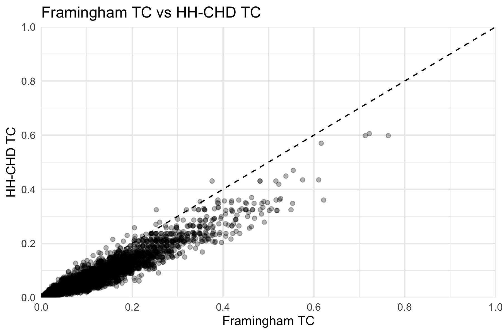
</div>

- Low-Density Lipoprotein (LDL) Estimate
**B. Low-Density Lipoprotein (LDL)**  
<div align="center">
  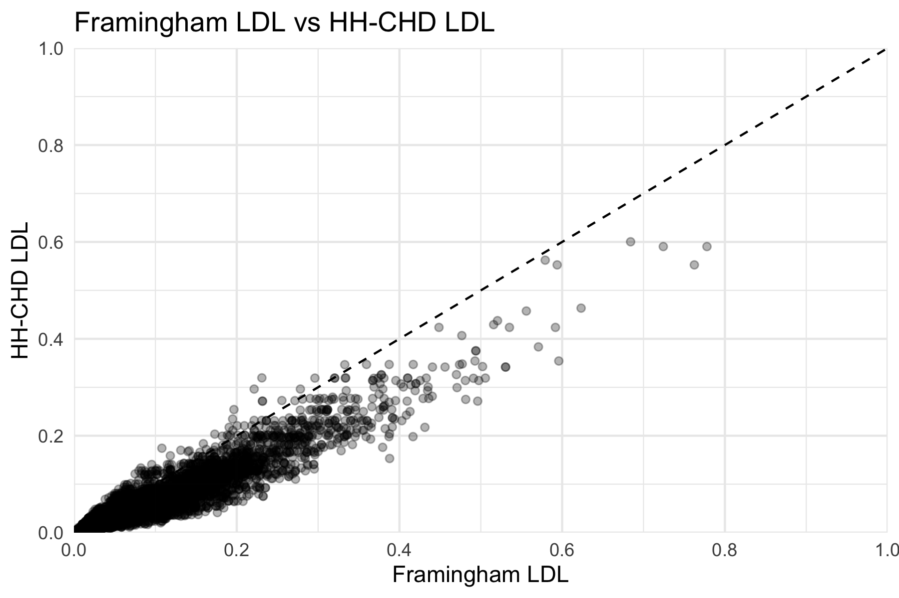
</div>

When populated with contemporary relative risks and prevalence figures, the HH-CHD calculator continued to show strong convergence with FRS estimates (r = .87 for TC; r = .85 for LDL). HH-CHD estimates were on average 2% lower, and 95% of estimates fell within 10% of the corresponding FRS estimates. Scatterplots illustrating this comparison are provided in .

We also examined whether convergence varied by participant sex or age.

Sex
When stratified by sex, HH-CHD predictions differed from FRS by an average of 2-3% in women and 3% in men. Limits of agreement were narrower among women (±5%) than men (±6%), indicating that individual-level differences were more tightly clustered. While both sexes showed minimal systematic bias, agreement was slightly stronger in women.

Age
Risk estimate differences between HH-CHD and FRS increased slightly with age, by approximately 2% in individuals under 50 to 5% in those over age 70. This corresponds to an increase of 0.1% per year, or ~1% per decade. Among individuals over age 70, 90% of HH-CHD scores still fell within  9% of FRS estimates, indicating stable convergence across age groups.

Sex–Age interaction
A small interaction effect between sex and age was observed in predicting differences between the HH-CHD and FRS estimates. However, this interaction explained less than 2% of the total variance, suggesting minimal practical impact.

Detailed results for all subgroup and interaction analyses are provided in .

## Limitations & Next Steps

Several limitations should be considered when interpreting the results of this study.

- Use of Synthetic Data
These analyses relied on a synthetic dataset constructed to mirror the distributions and covariances of the original Framingham cohort. While this allowed for precise control over model inputs and direct comparison of outputs, it lacks the real-world complexity of clinical data. Factors such as missing values, incomplete records, and more nuanced variable interdependencies were therefore not represented. Future research using actual clinical datasets will be necessary to confirm model performance.
- Absence of CHD Outcome Data
The study was designed to evaluate analytic convergence, not predictive validity. Since the synthetic dataset did not include CHD outcomes, the analyses cannot evaluate the real-world accuracy of either model in forecasting CHD events. Prospective validation efforts are currently underway using longitudinal clinical datasets, allowing for both HH-CHD and FRS to be tested against real-world CHD outcomes.
- Restricted Variables
Although the HH-CHD model is designed to incorporate a larger number and broader range of risk factors (including biomarkers, medications, and lifestyle variables) this study was restricted to the six variables used to calculate the FRS (age, cholesterol [TC and LDL], blood pressure, smoking, and diabetes). This constraint ensured a valid one-to-one comparison between estimates but did not permit evaluation of the extended capabilities of HH-CHD. Future work will examine the additive contribution of these additional HH-CHD variables.
- Use of a Single Baseline Survival Curve
To convert relative risk into absolute 10-year risk, a fixed, sex-specific baseline survival curve derived from the Framingham cohort was applied. While this maintained consistency with the original FRS methodology, it may limit generalizability to populations with different baseline event rates. Upcoming analyses will incorporate alternative survival curves (e.g., from ARIC or MESA) to test calibration across more diverse populations.

## Conclusion

The HH-CHD risk calculator achieved its analytic objective: it successfully replicated the 10-year coronary heart disease (CHD) risk estimates produced by the Framingham Risk Score (FRS) when provided with identical inputs. This high level of convergence, reflected in the near-identical estimates across the risk spectrum, demonstrates that the modular, literature-derived methodology used by the HH-CHD can emulate the output of a long-established, cohort-derived model with near-perfect fidelity.

When updated with contemporary relative risks and prevalence estimates, HH-CHD continued to produce results that closely tracked with FRS, while also reflecting modern epidemiologic data. Its structure allows individual risk factors to be added, removed, or recalibrated without reengineering the entire model—offering transparency, flexibility, and adaptability as new evidence emerges.

These findings represent an important foundational step in evaluating HH-CHD as a modern alternative to legacy risk calculator tools. While outcome-based validation in real-world populations remains essential and is currently underway, this analytic comparison provides strong preliminary support for HH-CHD’s methodological soundness and clinical potential. The model is well-positioned for continued development and future clinical integration.

## References

Arnett, D. K., Blumenthal, R. S., Albert, M. A., Buroker, A. B., Goldberger, Z. D., Hahn, E. J., Ziaeian, B. (2019). 2019 ACC/AHA guideline on the primary prevention of cardiovascular disease. Circulation, 140(11), e596–e646.
[https://doi.org/10.1161/CIR.0000000000000677](https://doi.org/10.1161/CIR.0000000000000677)

British Heart Foundation. (2025). Global heart & circulatory diseases factsheet.

Colditz, G. A., Atwood, K. A., Emmons, K., Monson, R. R., Willett, W. C., Trichopoulos, D., & Hunter, D. J. (2000). Harvard report on cancer prevention volume 4: Harvard Cancer Risk Index. Risk Index Working Group, Harvard Center for Cancer Prevention. Cancer causes & control : CCC, 11(6), 477–488. 
[https://doi.org/10.1023/A:1008984432272](https://doi.org/10.1023/A:1008984432272)

D’Agostino, R. B., Vasan, R. S., Pencina, M. J., Wolf, P. A., Cobain, M., Massaro, J. M., & Kannel, W. B. (2008). General cardiovascular risk profile for use in primary care: The Framingham Heart Study. Circulation, 117(6), 743–753. 
[https://doi.org/10.1161/CIRCULATIONAHA.107.699579](https://doi.org/10.1161/CIRCULATIONAHA.107.699579)

Després, J. P., Moorjani, S., Lupien, P. J., Tremblay, A., Nadeau, A., & Bouchard, C. (1990). Regional distribution of body fat, plasma lipoproteins, and cardiovascular disease. Arteriosclerosis, 10(4), 497–511.
[https://doi.org/10.1161/01.ATV.10.4.497](https://doi.org/10.1161/01.ATV.10.4.497)

Franklin, S. S., Gustin, W., Wong, N. D., Larson, M. G., Weber, M. A., Kannel, W. B., & Levy, D. (1997). Hemodynamic patterns of age-related changes in blood pressure: The Framingham Heart Study. Circulation, 96(1), 308–315.
[https://doi.org/10.1161/01.CIR.96.1.308](https://doi.org/10.1161/01.CIR.96.1.308)

Lauer MS, Anderson KM, Kannel WB, Levy D. The impact of obesity on left ventricular mass and geometry. The Framingham Heart Study. JAMA. 1991 Jul 10;266(2):231-6.
[https://doi.org/10.1001/jama.1991.03470020057032](https://doi.org/10.1001/jama.1991.03470020057032)

Saffer, B. Y. (2024). Accounting for mediation effects in risk prediction calculators (White paper). Harrison Healthcare. 

Shrier, I., Colditz, G. A., & Steele, R. J. (2018). Synthesizing risk from summary evidence across multiple risk factors. Epidemiology (Cambridge, Mass.), 29(4), 533–535.
[https://doi.org/10.1097/ede.0000000000000820](https://doi.org/10.1097/ede.0000000000000820)

Wilson, P. W. F., D’Agostino, R. B., Levy, D., Belanger, A. M., Silbershatz, H., & Kannel, W. B. (1998). Prediction of coronary heart disease using risk factor categories. Circulation, 97(18), 1837–1847. 
[https://doi.org/10.1161/01.CIR.97.18.1837](https://doi.org/10.1161/01.CIR.97.18.1837)

World Health Organization. (2021, June 11). Cardiovascular diseases (CVDs) fact sheet.
[https://www.who.int/news-room/fact-sheets/detail/cardiovascular-diseases-(cvds)](https://www.who.int/news-room/fact-sheets/detail/cardiovascular-diseases-(cvds))


## Appendix — Supplementary Methods, Equations, and Full Result Tables


### A1. Framingham 10-Year Risk: Full Computational Workflow

The Framingham 10-year risk score is calculated as follows:

Let:
```math
L_{\text{total} } = \sum_i \beta_i x_i
```

where each $x_i$ is a risk factor (e.g., $x_{\ln(\text{LDL})} = \ln(\text{LDL})$).

Compute:
```math
L_{\text{mean}} = \sum_i \beta_i \bar{x}_i
```

where $\bar{x}_i$ is the cohort mean.

```math
A = L_{\text{total}} - L_{\text{mean}}
```

```math
B = e^A
```

```math
S_{\text{abs},10} = S_0^B = \exp\bigl(B \ln S_0\bigr)
```

```math
R_{10} = 1 - S_{\text{abs},10} = 1 - \exp\bigl(B \ln S_0\bigr)
```

**Framingham LDL Worked Example**

Consider a 65-year-old man with:
- LDL = 165 mg/dL (4.26 mmol/L)
- Blood pressure = 130/80 mm Hg
- No diabetes
- Smoker

1. Compute $L_{\text{total}}$:
```math
L_{\text{total}} = \beta_{\ln(\text{LDL})} \times \ln(165) = 0.923 \times 5.1059 = 4.7099
```

2. Compute $L_{\text{mean}}$:
```math
L_{\text{mean}} = 3.00069
```

3. Compute $A$:
```math
A = 4.7099 - 3.00069 = 1.7092
```

4. Compute $B$:
```math
B = e^{1.7092} = 5.525
```

5. Compute absolute survival:
```math
S_{\text{abs},10} = 0.90017^{5.525} = \exp(5.525 \times \ln(0.90017)) = 0.615
```

6. Compute 10-year risk:
```math
R_{10} = 1 - 0.615 = 0.385 \quad (38.5\%)
```


### A2. HH-CHD Calculation: Modular, Log-Sum Framework

The HH-CHD 10-year risk is calculated similarly with updated baseline survival:

Let:
```math
L_{\text{total}} = \sum_i \beta_i x_i
```

```math
L_{\text{mean}} = \sum_i \beta_i \bar{x}_i
```

```math
A = L_{\text{total}} - L_{\text{mean}}
```

```math
B = e^A
```

```math
S_{\text{abs},10} = S_{0,\text{HH}}^B = \exp\bigl(B \ln S_{0,\text{HH}}\bigr)
```

```math
R_{10,\text{HH}} = 1 - S_{\text{abs},10} = 1 - \exp\bigl(B \ln S_{0,\text{HH}}\bigr)
```

**HH-CHD LDL Worked Example**

Using the same 65-year-old man:

1. Compute $L_{\text{total}}$:
```math
L_{\text{total}} = 0.923 \times \ln(165) = 4.7099
```

2. Compute $L_{\text{mean}}$:
```math
L_{\text{mean}} = 3.00069
```

3. Compute $A$:
```math
A = 4.7099 - 3.00069 = 1.7092
```

4. Compute $B$:
```math
B = e^{1.7092} = 5.525
```

5. Baseline survival:
```math
S_{0,\text{HH}} = 0.932
```

6. Compute absolute survival:
```math
S_{\text{abs},10} = 0.932^{5.525} = \exp(5.525 \times \ln(0.932)) = 0.680
```

7. Compute 10-year risk:
```math
R_{10,\text{HH}} = 1 - 0.680 = 0.320 \quad (32.0\%)
```


### A3. Synthetic Cohort Generation

A synthetic dataset of N = 10,000 adults (48% male) was generated to reflect the distributional characteristics of the original Framingham Heart Study (FHS). Seven continuous variables—age, systolic blood pressure (SBP), diastolic blood pressure (DBP), body mass index (BMI), total cholesterol (TC), low-density lipoprotein cholesterol (LDL), and high-density lipoprotein cholesterol (HDL)—were sampled from a multivariate normal distribution. Means and standard deviations were derived from Wilson et al. (1998), and a 7×7 correlation matrix was applied to impose realistic inter-variable relationships: SBP–DBP (r≈0.68) from Franklin et al. (1997), TC–LDL (r≈0.80) from Lauer et al. (1994), BMI–TC and BMI–HDL (r≈0.32, r≈–0.29) from D’Agostino et al. (2008) and Després et al. (1990), and age–lipids (r≈0.20) from Wilson et al. (1998).

This approach ensured that the simulated dataset preserved not only the individual distributions of variables but also their joint covariance structure, mirroring the characteristics observed in large epidemiologic cohorts.

Blood pressure was discretized into Joint National Committee (JNC-V) blood-pressure categories (Normal, High-Normal, Stage I, Stage II–IV). Binary flags for diabetes, smoking, and antihypertensive use were simulated based on prevalence rates conditional on SBP category. Age effects were modeled in 10-year bins (30-39 … 70-74) with the 40-49 bin normalized to a relative risk of 1.0 to align with FRS and HH-CHD specifications.


### A4. Statistical Software and Packages

All analyses were executed in R 4.3 (R Foundation, 2025): dplyr 1.1, irr 0.84, ggplot2 3.5, car 3.1, emmeans 1.10, psych 2.3, writexl 1.5. Model comparisons were conducted using Pearson and Spearman correlations, intraclass correlation coefficients (ICC) for absolute agreement, Bland–Altman analyses to assess bias and limits of agreement, and Type II ANCOVA to explore age and sex effects.


### A5. Overall Agreement - Framingham Inputs

Table 1. Agreement and Correlation Metrics for Framingham vs HH-CHD Risk Scores

| Metric | Framingham TC vs HH-CHD TC | Framingham LDL vs HH-CHD LDL |
|---|---|---|
| Pearson r | 0.950 | 0.939 |
| Spearman ρ | 0.937 | 0.923 |
| ICC | 0.825 | 0.805 |
| Mean difference (Framingham − HH-CHD) | 0.029 | 0.030 |
| 95 % LoA (±1.96 SD) | −0.026 to +0.084 | −0.027 to +0.087 |

Abbreviations: TC, total cholesterol; LDL, low-density lipoprotein cholesterol; HH-CHD, Harrison Healthcare coronary heart disease risk calculator; ICC, intraclass correlation coefficient; LoA, limits of agreement.

Figure 2. Bland–Altman Plots Comparing Framingham and HH-CHD Risk Calculators

- TC Estimate

**A. Total Cholesterol (TC)**  
<div align="center">
  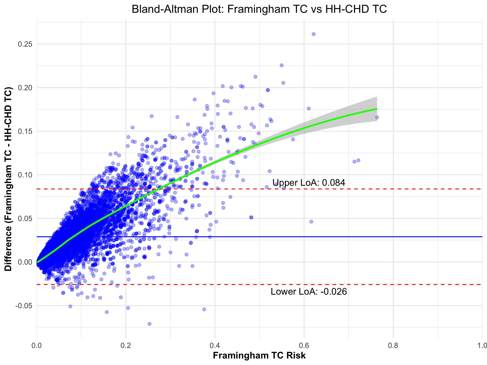
</div>

- LDL Estimate
**B. Low-Density Lipoprotein (LDL)**  
<div align="center">
  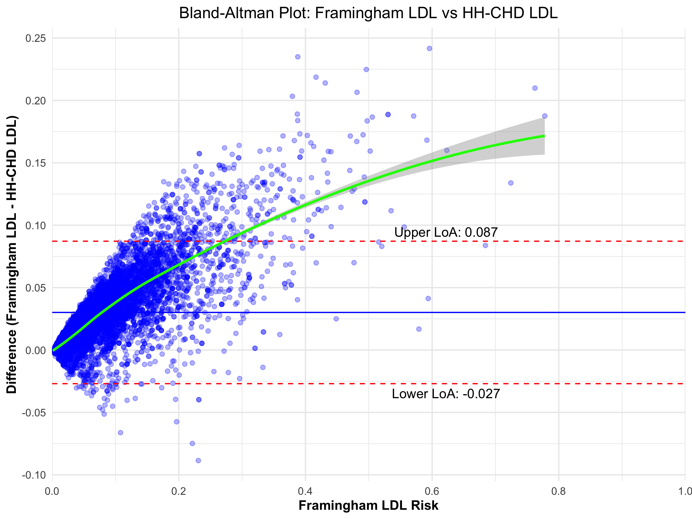
</div>

Abbreviations: LDL, low-density lipoprotein cholesterol; TC, total cholesterol; LoA, limits of agreement.


### A6. Subgroup Bland–Altman Statistics (Sex and Age) - Framingham Inputs

Table 2. Age- and Sex-Stratified Bland-Altman Statistic Comparing Framingham vs HH-CHD

| Model | Group | Bias | LoA | Pearson | Spearman |
|---|---|---|---|---|---|
| TC | Female | 0.024 | 0.045 | 0.901 | 0.915 |
| TC | Male | 0.034 | 0.062 | 0.952 | 0.946 |
| TC | <50 | 0.019 | 0.037 | 0.918 | 0.920 |
| TC | 50-70 | 0.041 | 0.060 | 0.934 | 0.909 |
| TC | >70 | 0.047 | 0.088 | 0.971 | 0.953 |
| LDL | Female | 0.028 | 0.049 | 0.912 | 0.923 |
| LDL | Male | 0.033 | 0.064 | 0.943 | 0.929 |
| LDL | <50 | 0.019 | 0.039 | 0.903 | 0.904 |
| LDL | 50-70 | 0.043 | 0.062 | 0.920 | 0.890 |
| LDL | >70 | 0.049 | 0.086 | 0.968 | 0.949 |

Abbreviations: TC, total cholesterol; LDL, low-density lipoprotein cholesterol; LoA, limits of agreement.

Figure 3. Bland–Altman Plots Comparing Framingham and HH-CHD Risk Calculators, Stratified by Sex

- TC Estimate
**A. Total Cholesterol (TC)**  
<div align="center">
  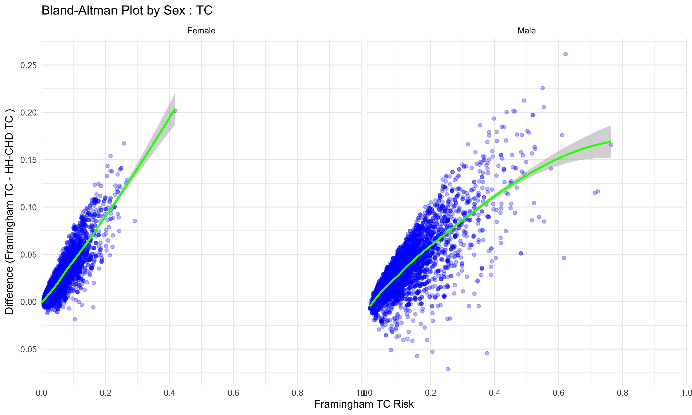
</div>

- LDL Estimate
**B. Low-Density Lipoprotein (LDL)**  
<div align="center">
  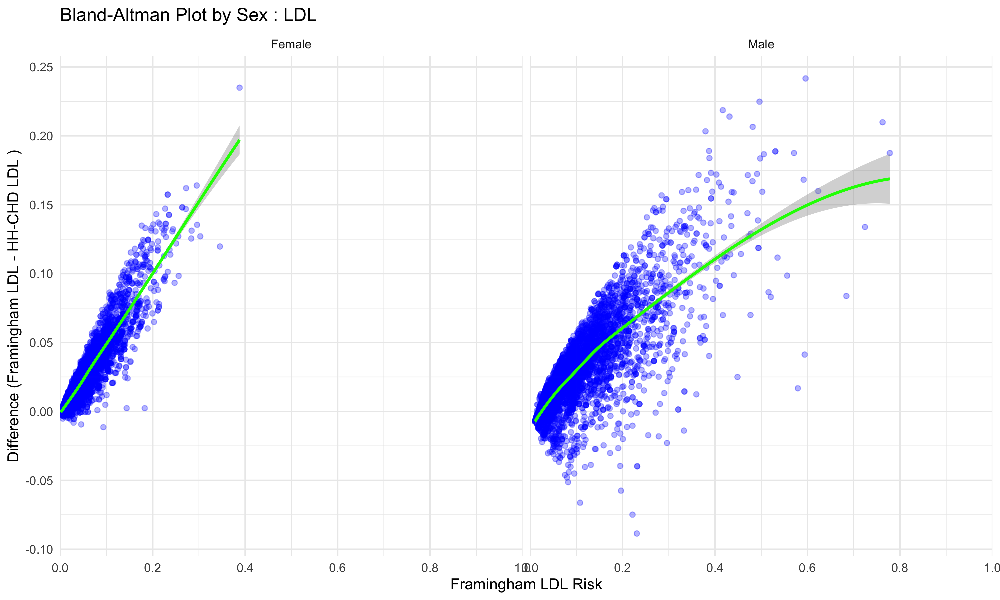
</div>

Abbreviations: LDL, low-density lipoprotein cholesterol; TC, total cholesterol.

Figure 4. Bland–Altman Plots Comparing Framingham and HH-CHD Risk Calculators, Stratified by Age

- TC Estimate
**A. Total Cholesterol (TC)**  
<div align="center">
  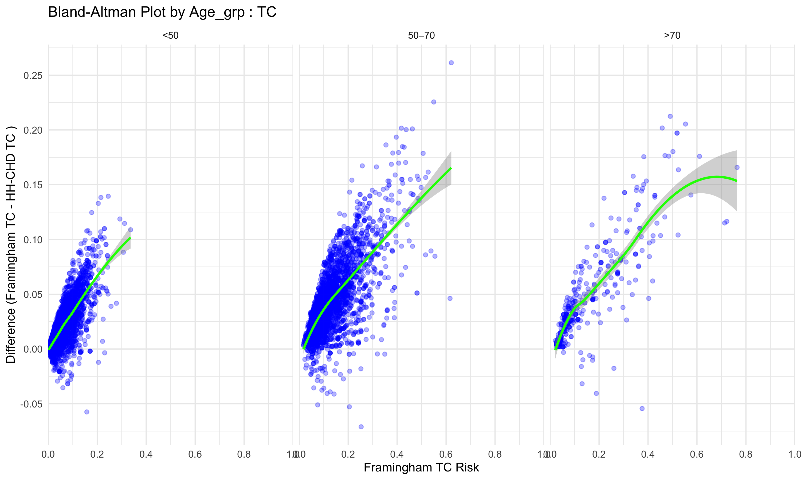
</div>

- LDL Estimate
**B. Low-Density Lipoprotein (LDL)**  
<div align="center">
  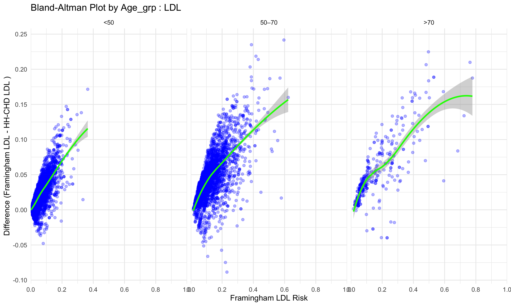
</div>

Abbreviations: LDL, low-density lipoprotein cholesterol; TC, total cholesterol; grp, group.


### A7. ANCOVA: Type II Tests of Bias - Framingham Inputs

Table 3. Type II ANCOVA of Bias Framingham vs HH-CHD

| Model | Term | Sum Sq | Df | F value | Pr(>F) | MS | Partial η² |
|---|---|---|---|---|---|---|---|
| TC | Mean TC Risk | 1.7634 | 1 | 4853.80 | <.0001 | 1.7634 | 0.3269 |
| TC | Sex | 0.0902 | 1 | 248.40 | <.0001 | 0.0902 | 0.0242 |
| TC | Age | 0.0590 | 1 | 162.35 | <.0001 | 0.0590 | 0.0160 |
| TC | Sex × Age | 0.0248 | 1 | 68.30 | <.0001 | 0.0248 | 0.0068 |
| TC | Residuals | 3.6313 | 9995 | — | — | 0.0004 | 0.5000 |
| LDL | Mean LDL Risk | 2.1717 | 1 | 5452.90 | <.0001 | 2.1717 | 0.3530 |
| LDL | Sex | 0.2722 | 1 | 683.39 | <.0001 | 0.2722 | 0.0640 |
| LDL | Age | 0.0755 | 1 | 189.69 | <.0001 | 0.0755 | 0.0186 |
| LDL | Sex × Age | 0.0871 | 1 | 218.65 | <.0001 | 0.0871 | 0.0214 |
| LDL | Residuals | 3.9807 | 9995 | — | — | 0.0004 | 0.5000 |

Abbreviations: TC, total cholesterol; LDL, low-density lipoprotein cholesterol; Sum Sq, sum of squares; Df, degrees of freedom; F value, F-statistic; Pr(>F), probability (p-value) that the observed F exceeds the critical value under the null hypothesis; MS, mean square; partial η², partial eta-squared.


### A8. Simple-Slope & Adjusted-Mean Results - Framingham Inputs

Table 4. Simple Slopes & Adjusted Means Framingham vs HH-CHD

| Model | Sex | Age Slope (SE) | t (df) | p | Adj. Mean Bias (95 % CI) | Female−Male Contrast (95 % CI) | p |
|---|---|---|---|---|---|---|---|
| TC | Female | 0.0004 (0.0001) | 15.13 (9995) | < .001 | 0.033 (0.032, 0.033) | 0.008 (0.007, 0.009) | < .001 |
| TC | Male | 0.0001 (0.0001) | 2.28 (9995) | .022 | 0.025 (0.024, 0.025) | — | — |
| LDL | Female | 0.0005 (0.0000) | 19.26 (9995) | < .001 | 0.037 (0.036, 0.037) | 0.014 (0.013, 0.015) | < .001 |
| LDL | Male | -0.0001 (0.0000) | -1.74 (9995) | .081 | 0.023 (0.022, 0.023) | — | — |

Abbreviations: TC, total cholesterol; LDL, low-density lipoprotein cholesterol; SE, standard error; t, t-statistic; df, degrees of freedom; p, two-tailed probability value; Adj., adjusted; CI, confidence interval.

Figure 5. Simple Slopes Bias vs Age by Sex

- TC Estimate
**A. Total Cholesterol (TC)** 
<div align="center">
  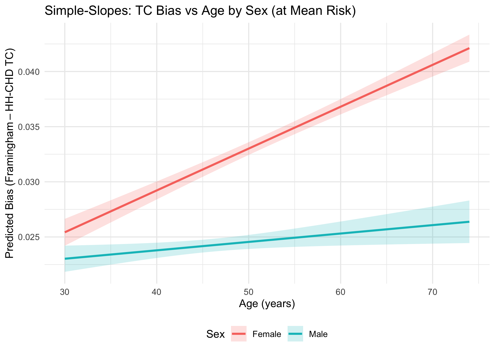
</div>

- LDL Estimate
**B. Low-Density Lipoprotein (LDL)**  
<div align="center">
  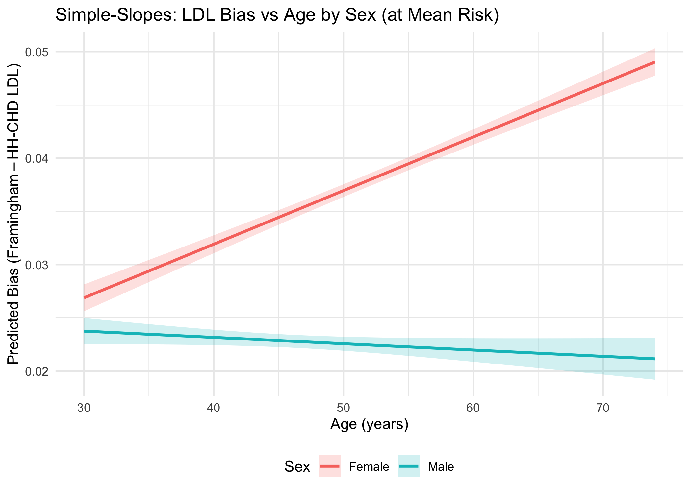
</div>

Abbreviations: LDL, low-density lipoprotein cholesterol; TC, total cholesterol; HH, Harrison Healthcare risk calculator.

Figure 6. Adjusted Mean Bias
<div align="center">
  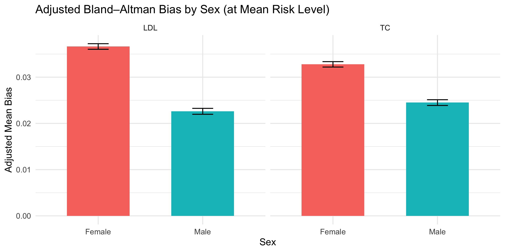
</div>

Abbreviations: LDL, low-density lipoprotein cholesterol; TC, total cholesterol.


### A9. Overall Agreement – Contemporary Inputs

Table 5. Agreement and Correlation Metrics for Framingham vs HH-CHD Risk Scores

| Metric | Framingham TC vs HH-CHD | Framingham LDL vs HH-CHD |
|---|---|---|
| Pearson correlation (r) | 0.865 | 0.854 |
| Spearman correlation (ρ) | 0.860 | 0.855 |
| ICC | 0.811 | 0.802 |
| Mean difference (Framingham – HH) | 0.020 | 0.018 |
| 95 % LoA (±1.96 SD) | ± 0.097 | ± 0.101 |

Abbreviations: TC, total cholesterol; LDL, low-density lipoprotein cholesterol; HH-CHD, Harrison Healthcare coronary heart disease risk calculator; ICC, intraclass correlation coefficient; LoA, limits of agreement.

Figure 7. Scatterplots Framingham vs HH-CHD

- TC Estimate
**A. Total Cholesterol (TC)**  
<div align="center">
  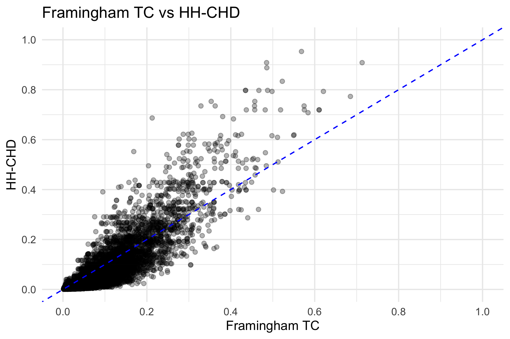
</div>

- LDL Estimate
**B. Low-Density Lipoprotein (LDL)**  
<div align="center">
  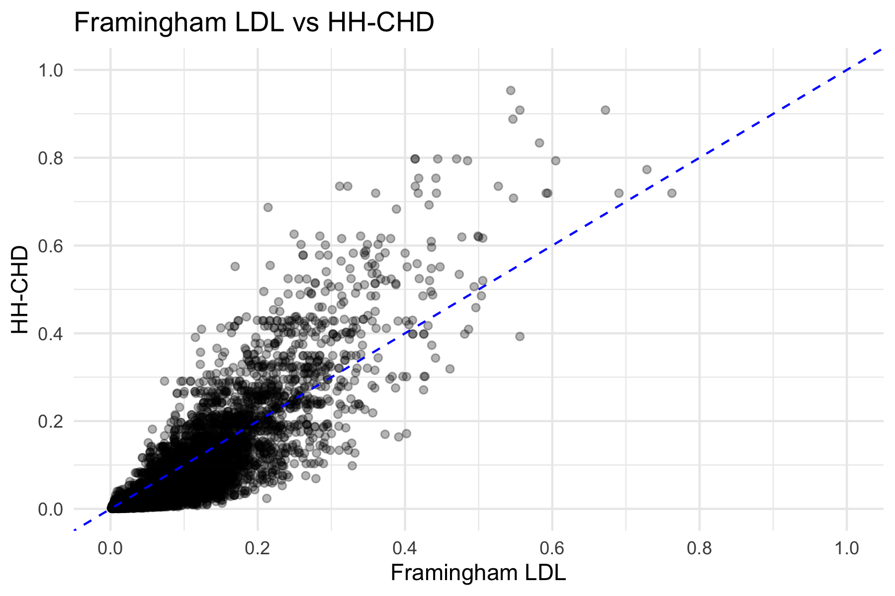
</div>

Abbreviations: LDL, low-density lipoprotein cholesterol; TC, total cholesterol; HH, Harrison Healthcare risk calculator.

Figure 8. Bland–Altman Plots Comparing Framingham and HH-CHD Risk Calculators

- TC Estimate

**A. Total Cholesterol (TC)**  
<div align="center">
  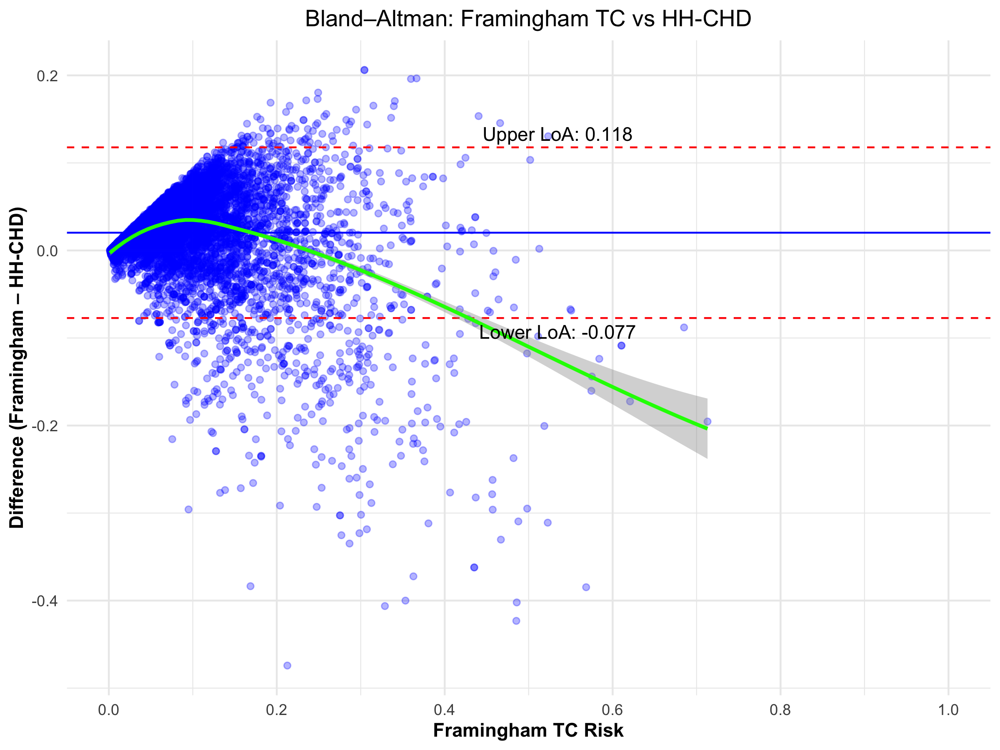
</div>

- LDL Estimate
**B. Low-Density Lipoprotein (LDL)**  
<div align="center">
  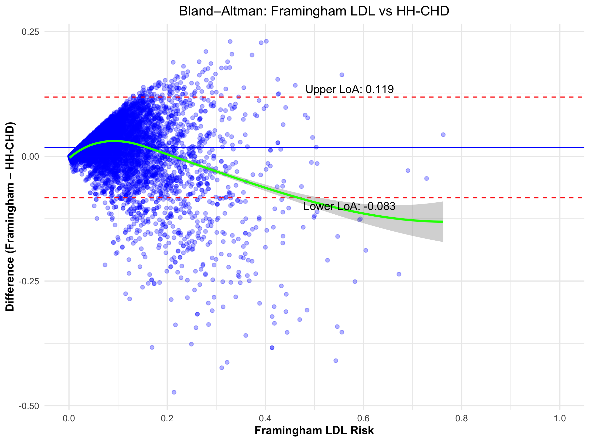
</div>

Abbreviations: HH, Harrison Healthcare risk calculator; LDL, low-density lipoprotein cholesterol; TC, total cholesterol; LoA, limits of agreement.


### A10. Subgroup Bland–Altman Statistics (Sex and Age) – Contemporary Inputs

Table 6. Age- and Sex-Stratified Bland-Altman Statistic Comparing Framingham vs HH-CHD

| Model | Group | Bias | LoA | Pearson | Spearman |
|---|---|---|---|---|---|
| TC | Female | 0.016 | 0.071 | 0.767 | 0.840 |
| TC | Male | 0.025 | 0.119 | 0.886 | 0.894 |
| TC | <50 | 0.015 | 0.122 | 0.857 | 0.831 |
| TC | 50-70 | 0.028 | 0.053 | 0.754 | 0.765 |
| TC | >70 | -0.021 | 0.160 | 0.861 | 0.819 |
| LDL | Female | 0.016 | 0.071 | 0.765 | 0.840 |
| LDL | Male | 0.020 | 0.125 | 0.870 | 0.870 |
| LDL | <50 | 0.011 | 0.128 | 0.840 | 0.816 |
| LDL | 50-70 | 0.026 | 0.053 | 0.750 | 0.764 |
| LDL | >70 | -0.024 | 0.157 | 0.867 | 0.831 |

Abbreviations: TC, total cholesterol; LDL, low-density lipoprotein cholesterol; LoA, limits of agreement.

Figure 9. Bland–Altman Plots Comparing Framingham and HH-CHD Risk Calculators, Stratified by Age

- TC Estimate
**A. Total Cholesterol (TC)**  
<div align="center">
  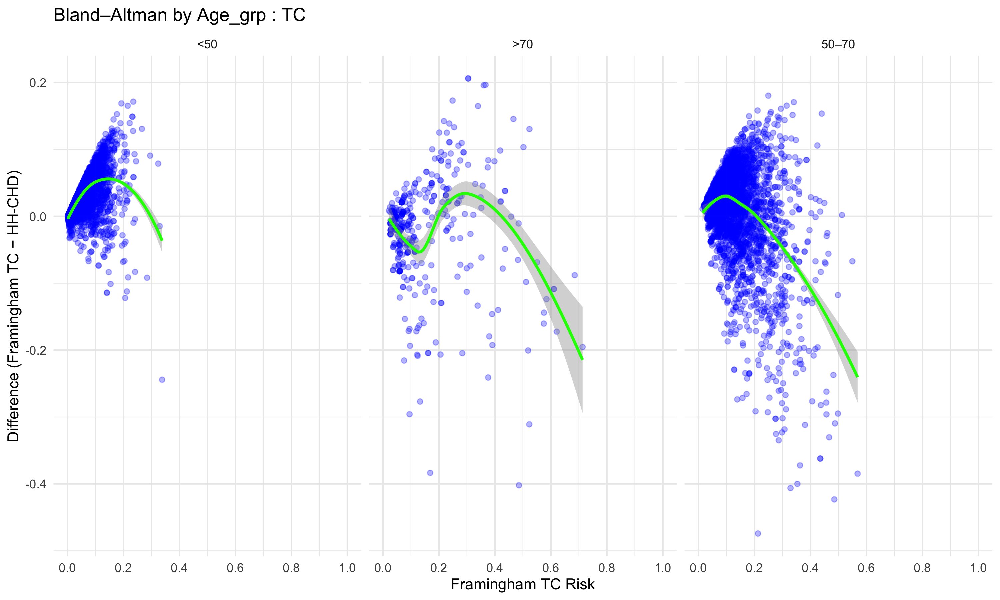
</div>

- LDL Estimate
**B. Low-Density Lipoprotein (LDL)**  
<div align="center">
  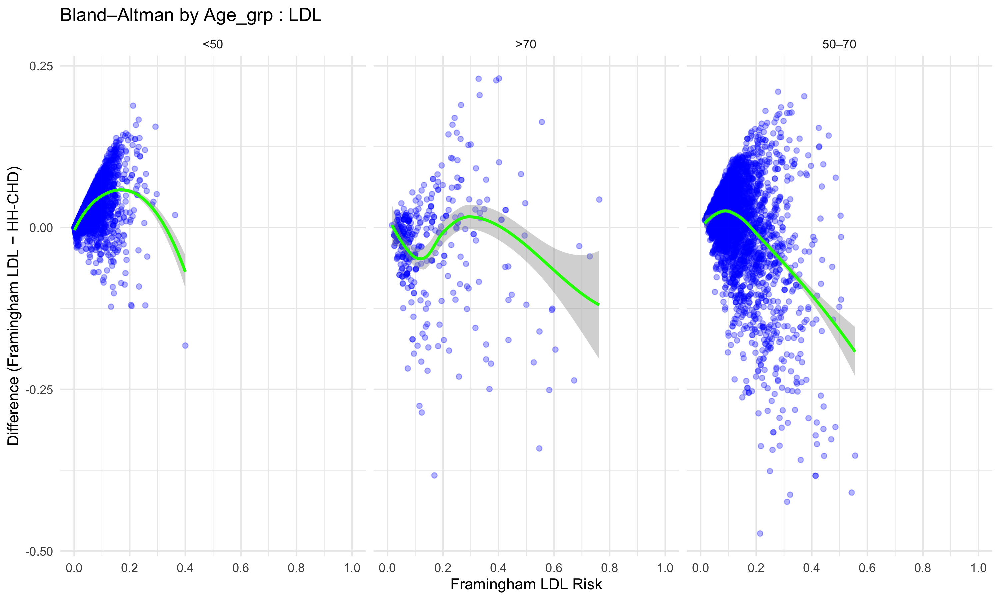
</div>

Abbreviations: HH, Harrison Healthcare risk calculator; LDL, low-density lipoprotein cholesterol; TC, total cholesterol; grp, group.

Figure 10. Bland–Altman Plots Comparing Framingham and HH-CHD Risk Calculators, Stratified by Sex

- TC Estimate
**A. Total Cholesterol (TC)**  
<div align="center">
  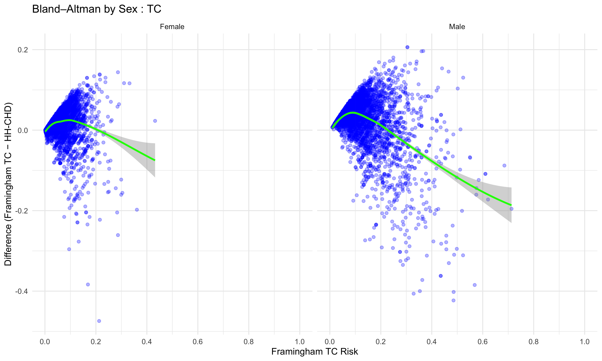
</div>

- LDL Estimate
**B. Low-Density Lipoprotein (LDL)**  
<div align="center">
  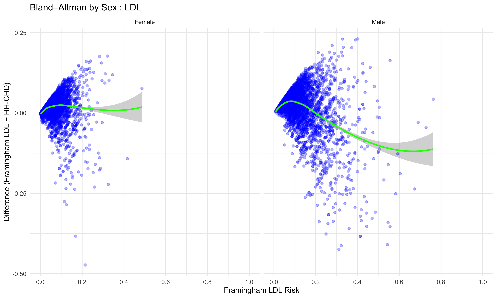
</div>

Abbreviations: HH, Harrison Healthcare risk calculator; LDL, low-density lipoprotein cholesterol; TC, total cholesterol.


### A11. ANCOVA: Type II Tests of Bias – Contemporary Inputs

Table 7. Type II ANCOVA of Bias Framingham vs HH-CHD

| Model | Term | Sum Sq | Df | F value | Pr(>F) | MS | Partial η² |
|---|---|---|---|---|---|---|---|
| TC | Mean TC Risk | 1.7634 | 1 | 4853.80 | <0.0001 | 1.7634 | 0.3269 |
| TC | Sex | 0.0902 | 1 | 248.40 | <0.0001 | 0.0902 | 0.0242 |
| TC | Age | 0.0590 | 1 | 162.35 | <0.0001 | 0.0590 | 0.0160 |
| TC | Sex × Age | 0.0248 | 1 | 68.30 | <0.0001 | 0.0248 | 0.0068 |
| TC | Residuals | 3.6313 | 9995 | — | — | 0.0004 | 0.5000 |
| LDL | Mean LDL Risk | 0.0906 | 1 | 114.53 | <0.0001 | 0.0906 | 0.0114 |
| LDL | Sex | 2.0912 | 1 | 2643.24 | <0.0001 | 2.0912 | 0.2095 |
| LDL | Age | 0.0207 | 1 | 26.19 | <0.0001 | 0.0207 | 0.0026 |
| LDL | Sex × Age | 0.3816 | 1 | 482.30 | <0.0001 | 0.3816 | 0.1530 |
| LDL | Residuals | 7.9075 | 9995 | — | — | 0.0008 | 0.5000 |

Abbreviations: TC, total cholesterol; LDL, low-density lipoprotein cholesterol; Sum Sq, sum of squares; Df, degrees of freedom; F value, F-statistic; Pr(>F), probability (p-value) that the observed F exceeds the critical value under the null hypothesis; MS, mean square; partial η², partial eta-squared.


## A12. Simple-Slope & Adjusted-Mean Results – Contemporary Inputs

Table 8. Simple Slopes & Adjusted Means Framingham vs HH-CHD

| Model | Sex | Age Slope (SE) | t (df) | p | Adj. Mean Bias (95 % CI) | Female − Male Contrast (95 % CI) | p |
|---|---|---|---|---|---|---|---|
| TC | Female | 0.0009 (0.0001) | 17.25 (9995) | < .001 | 0.003 (0.002, 0.004) | –0.037 (–0.038, –0.035) | < .001 |
| TC | Male | 0.0011 (0.0001) | 16.36 (9995) | < .001 | 0.039 (0.038, 0.041) | — | — |
| LDL | Female | 0.0009 (0.0001) | 15.62 (9995) | < .001 | 0.005 (0.003, 0.006) | –0.027 (–0.029, –0.026) | < .001 |
| LDL | Male | 0.0006 (0.0001) | 8.51 (9995) | < .001 | 0.032 (0.031, 0.033) | — | — |

Abbreviations: TC, total cholesterol; LDL, low-density lipoprotein cholesterol; SE, standard error; t, t-statistic; df, degrees of freedom; p, two-tailed probability value; Adj., adjusted; CI, confidence interval.

Figure 11. Simple Slopes Bias vs Age by Sex

- TC Estimate
**A. Total Cholesterol (TC)**  
<div align="center">
  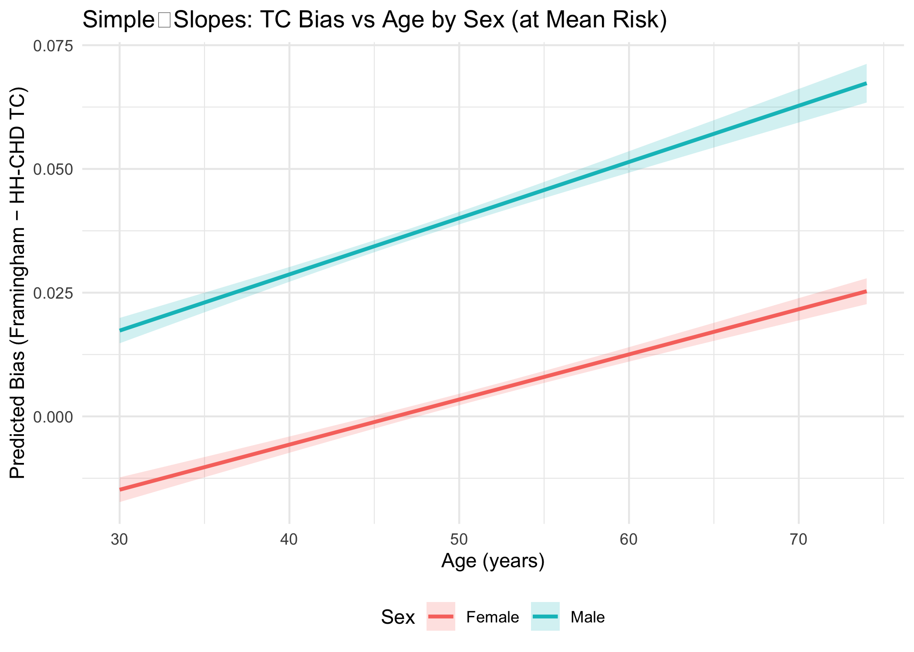
</div>

- LDL Estimate
**B. Low-Density Lipoprotein (LDL)**  
<div align="center">
  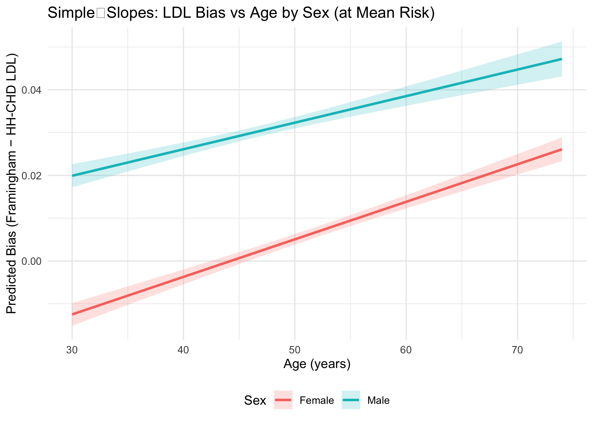
</div>

Abbreviations: HH, Harrison Healthcare risk calculator; LDL, low-density lipoprotein cholesterol; TC, total cholesterol.

Figure 12. Adjusted Mean Bias

<div align="center">
  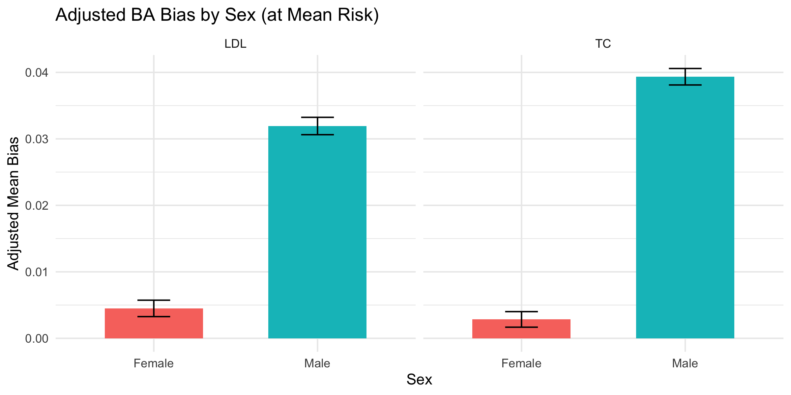
</div>


Abbreviations: HH, Harrison Healthcare risk calculator; LDL, low-density lipoprotein cholesterol; TC, total cholesterol.


### A13. Code Availability

All R scripts, and step-by-step analytical pipelines used in this study are openly available at GitHub (https://github.com/Harrison-Healthcare/Risk_Calculator).


